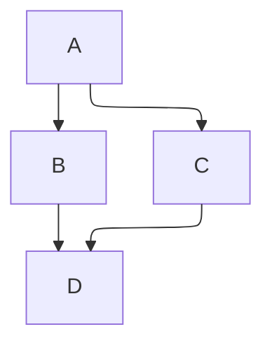

---
# metadata
created: 2026-01-03T00:00
modified: 2026-01-11T09:21
---

# Markdown

## Headings

### H3

#### H4

##### H5

###### H6

## Links & Embeds

[link to headings](<#Headings>)

[learn Markdown in 10 minutes](https://commonmark.org/help/)

a footer link[^1]


## Paragraph & Formats

line1
line2  
line3

line4

**bold**

*italic*

~~strikethrough~~

<ins>underline</ins>

==highlight==

%% comment %%

`code`

---

## Lists

### Unordered List

- 1
- 2
- 3

### Ordered List

1. a
2. b
   1. a
   2. b
   3. c
3. c

### Task List

- [x] a
- [ ] b
- [ ] c

### Definition List

## Blockquotes

> 1  
> 2

## Admonitions

> [!note] github alerts
> - note
> - tip
> - important
> - warning
> - caution

:::info

- note
- tip
- info
- waring
- danger

:::

## Code

```js
console.log('Hello World!');
```

## Math Equations

### inline

Let $f\colon[a,b]\to\R$ be Riemann integrable. Let $F\colon[a,b]\to\R$ be  
$F(x)=\int_{a}^{x} f(t)\,dt$. Then $F$ is continuous, and at all $x$ such that  
$f$ is continuous at $x$, $F$ is differentiable at $x$ with $F'(x)=f(x)$.

### block

$$
I = \int_0^{2\pi} \sin(x)\,dx
$$

## Diagrams



## Tables

| Column 1 | Column 2 | Column 3 |
| -------- | -------- | -------- |
| Data 1   | Data 2   | Data 3   |

## Parser

- [markdown-it](https://github.com/markdown-it/markdown-it)
- [marked](https://github.com/markedjs/marked)
- [showdown](https://github.com/showdownjs/showdown)
- [remark](https://github.com/remarkjs/remark)
- [remarkable](https://github.com/jonschlinkert/remarkable)

## Editor

- [Ace](https://github.com/ajaxorg/ace)
- [CodeMirror](https://github.com/codemirror/dev/)
- [Monaco](https://github.com/microsoft/monaco-editor)
- [quill](https://github.com/slab/quill)
- https://github.com/ianstormtaylor/slate
- https://github.com/codex-team/editor.js
- https://github.com/benweet/stackedit
- https://github.com/nhn/tui.editor
- https://github.com/tinymce/tinymce
- https://github.com/pandao/editor.md
- https://github.com/Milkdown/milkdown
- https://github.com/Vanessa219/vditor
- https://github.com/TypeCellOS/BlockNote
- https://github.com/charmbracelet/glow

## Resources

- https://help.obsidian.md/syntax
- https://commonmark.org/help/
- https://www.markdownguide.org/cheat-sheet/
- https://markdown.com.cn/
- https://github.github.com/gfm/
- https://daringfireball.net/projects/markdown/syntax
- https://support.typoraio.cn/zh/Markdown-Reference/

[^1]: test footer note