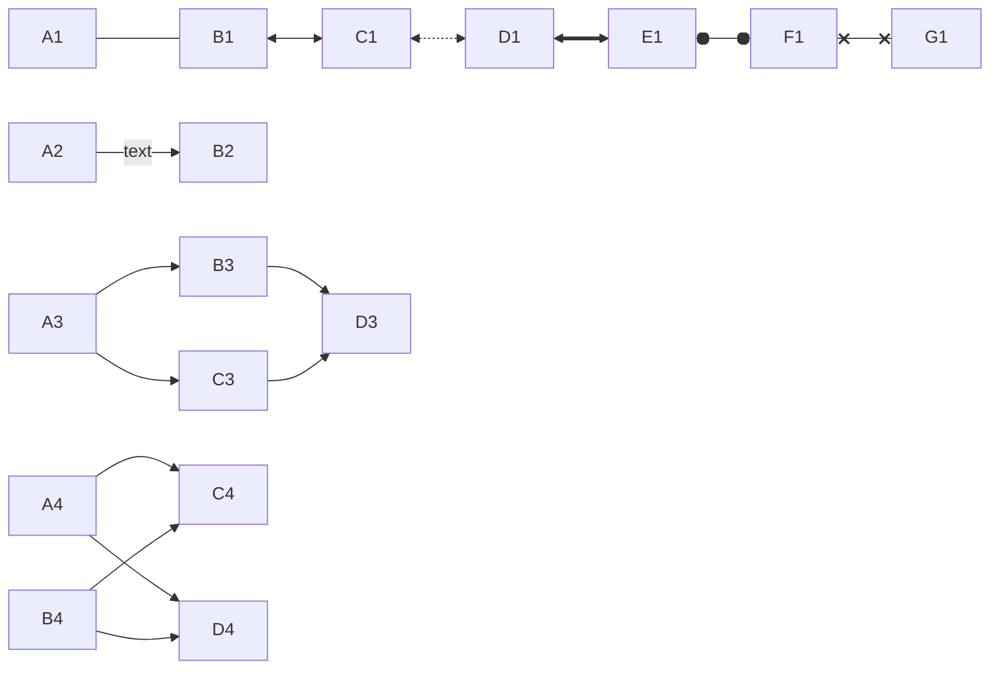

# Mermaid

- flowchart
- sequenceDiagram
- classDiagram
- stateDiagram-v2
- erDiagram
- journey
- gantt
- pie
- quadrantChart
- requirementDiagram
- gitGraph
- C4Context
    - System Context (C4Context)
    - Container diagram (C4Container)
    - Component diagram (C4Component)
    - Dynamic diagram (C4Dynamic)
    - Deployment diagram (C4Deployment)
- mindmap
- timeline
- zenuml
- sankey-beta
- xychart-beta
- block-beta
- packet-beta
- kanban
- architecture-beta
- radar-beta

## Flowchart

direction

- TB - Top to bottom
- TD - Top-down/ same as top to bottom
- BT - Bottom to top
- RL - Right to left
- LR - Left to right

### Node

### Link

### subgraph