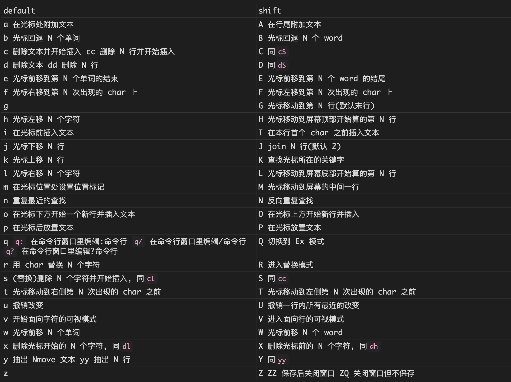
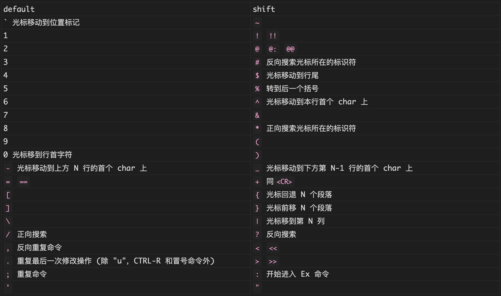

## Hotkey

### Normal





## Config

```vim
set nocp
set mouse=a
colorscheme desert

syntax enable
filetype plugin indent on

set nu ru rnu cul cuc

set ts=4 sw=4 sts=4 et ai

set hls is scs

set clipboard^=unnamed,unnamedplus
```

## Plugin